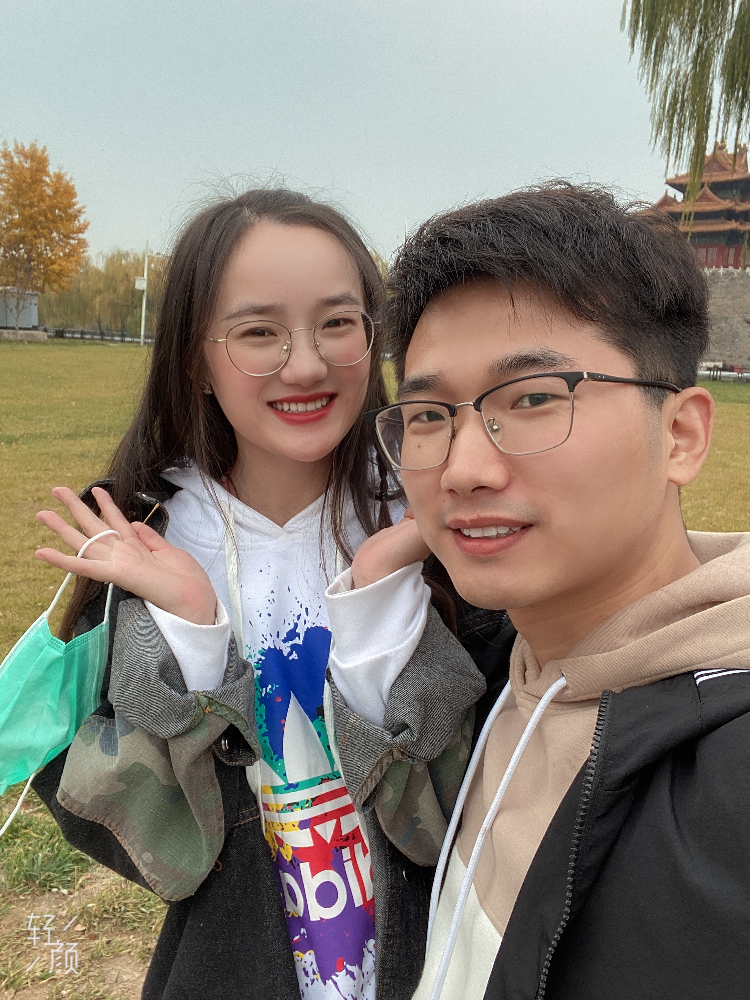
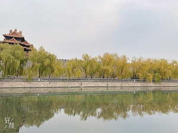
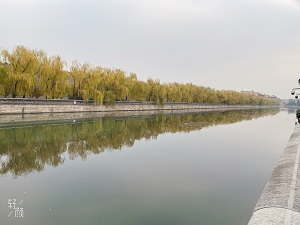
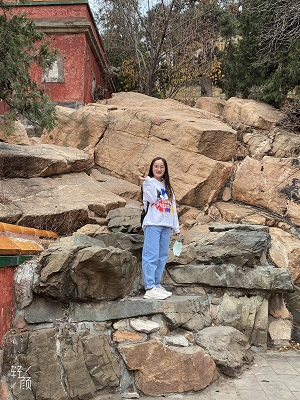
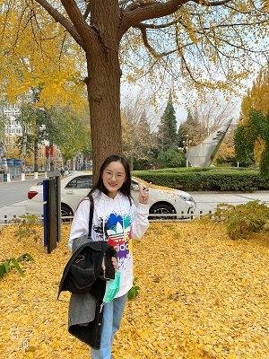
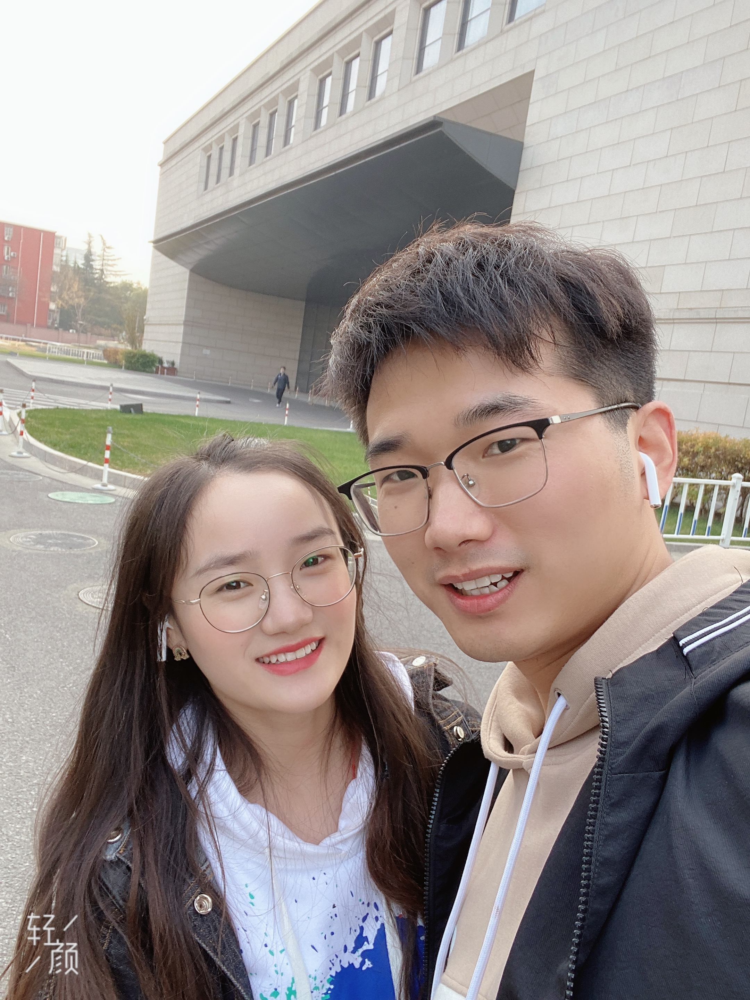
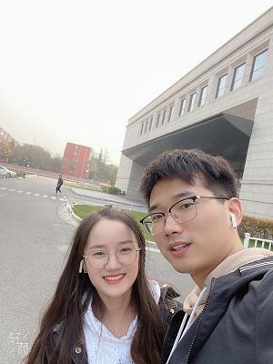

愿我们能一起走过这平凡的岁月，度过生活中每一点美好。

# 她来北京啦

## 2020年11月13日记：

从早上开始我就一直等宝贝过来。

来北邮，晚上，天气微凉

## 2020年11月14日记：

早上好多了，游玩地：鼓楼大街，故宫，颐明园，晚上吃了食宝街，我们一起回去看了五哈的故事，我们都很喜欢五兄弟~

- 我们在鼓楼大街 & 故宫附近（下次跟宝贝一起逛逛故宫）

- 护城河 & 故宫

- 颐和园（颐和园真的好大，进去的第一眼惊艳到我了~）

## 2020年11月15日记：

早上带宝贝吃了北邮食堂，中午一直在图书馆学习，陪宝贝吃了楼上楼，接着去了字节跳动，带她混进了公司啦嘿嘿。

- 宝贝在图书馆银杏树下，好漂亮嘿嘿

- 我们在公司附近

然后我们去了北京南站，时间一下就过去了，过去的贼快，如眨眼间两天就过去了，好舍不得~

## 末记：

故宫的初冬，有那么一点点寒冷，不过有园子的陪伴，真的很幸福，很开心~

北京城那么大，我们还有很多地方没有打卡留恋，留给未来更多的机会让我们一起游玩，未来可期~

